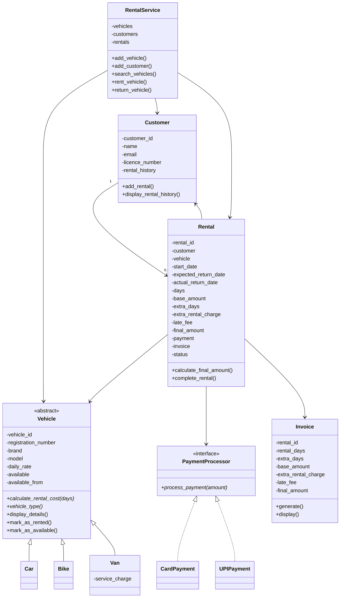

# Class Diagram

```mermaid
classDiagram

class Vehicle {
    <<abstract>>
    -vehicle_id
    -registration_number
    -brand
    -model
    -daily_rate
    -available
    -available_from
    +calculate_rental_cost(days)*
    +vehicle_type()*
    +display_details()
    +mark_as_rented()
    +mark_as_available()
}

class Car
class Bike
class Van {
    -service_charge
}

Vehicle <|-- Car
Vehicle <|-- Bike
Vehicle <|-- Van

class Customer {
    -customer_id
    -name
    -email
    -licence_number
    -rental_history
    +add_rental()
    +display_rental_history()
}

class PaymentProcessor {
    <<interface>>
    +process_payment(amount)*
}

class CardPayment
class UPIPayment

PaymentProcessor <|.. CardPayment
PaymentProcessor <|.. UPIPayment

class Rental {
    -rental_id
    -customer
    -vehicle
    -start_date
    -expected_return_date
    -actual_return_date
    -days
    -base_amount
    -extra_days
    -extra_rental_charge
    -late_fee
    -final_amount
    -payment
    -invoice
    -status
    +calculate_final_amount()
    +complete_rental()
}

class Invoice {
    -rental_id
    -rental_days
    -extra_days
    -base_amount
    -extra_rental_charge
    -late_fee
    -final_amount
    +generate()
    +display()
}

class RentalService {
    -vehicles
    -customers
    -rentals
    +add_vehicle()
    +add_customer()
    +search_vehicles()
    +rent_vehicle()
    +return_vehicle()
}

Rental --> Customer
Rental --> Vehicle
Rental --> PaymentProcessor
Rental --> Invoice
Customer "1" --> "0..*" Rental
RentalService --> Vehicle
RentalService --> Customer
RentalService --> Rental
```
